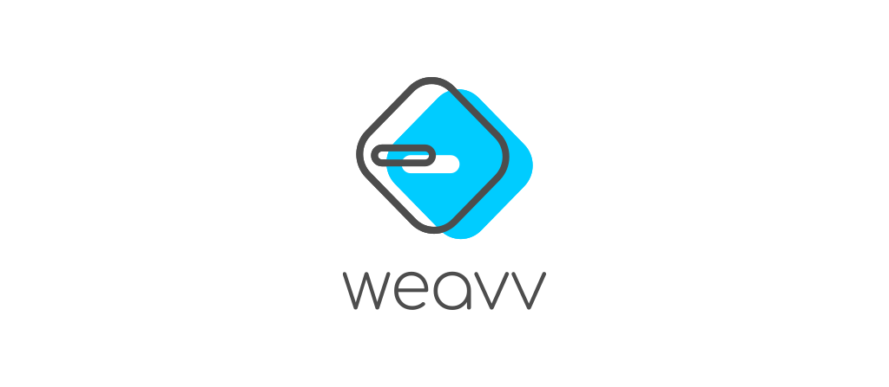

[](https://app.netlify.com/sites/weavvcss/deploys)



## WEAVV CSS Documentation

> [Read the official documentation](https://weavvcss.netlify.app)

### Developer Tools

- [WEAVV Playground](https://weavvcss.netlify.app/playground) - Live code editor for testing and prototyping.
- [WEAVV CLI](https://www.npmjs.com/package/weavv) - Create empty project on-the-go with preprocessing and postprocessing options.

### Features

- [Breakpoints](https://weavvcss.netlify.app/responsive-utilities/)
- [Dark/Light Mode](https://weavvcss.netlify.app/getting-started-themes/)
- [Variants](https://weavvcss.netlify.app/pseudo-class-variants/)
- [Color Palette](https://weavvcss.netlify.app/getting-started-palette/)
- [Gradient Presets](https://weavvcss.netlify.app/getting-started-gradient/)
- [Custom Gradient](https://weavvcss.netlify.app/background-gradient/)
- [Animations](https://weavvcss.netlify.app/getting-started-animations/)
- [Filters](https://weavvcss.netlify.app/getting-started-filters/)
- [Fluids](https://weavvcss.netlify.app/getting-started-fluids/)
- [Orientation](https://weavvcss.netlify.app/getting-started-orientation)
- [Plugin API](https://weavvcss.netlify.app/plugin-api/)

### Build

clone the repository,

```bash
$ git clone https://github.com/weavv/weavv-css-documentation.git
$ cd weavv-css-documentation
```

install dependencies,

```bash
# YARN
$ yarn
# NPM
$ npm i
```

serve locally,

```bash
# YARN
$ yarn dev
# NMP
$ npm run dev
```

---

[MIT](https://github.com/weavv/weavv-css/blob/master/LICENSE)
